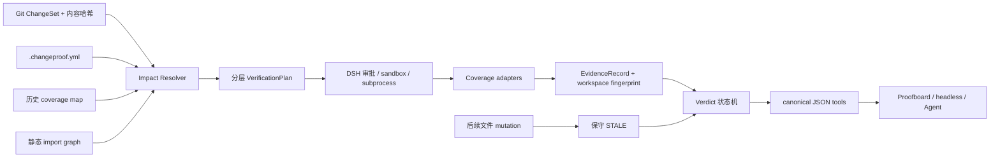

# ChangeProof（`dsh-changeproof`）项目方案

> DeepSeek Harness 原生的“变更相关性 + 验证证据新鲜度”质量插件

## 0. 文档元信息与事实状态

| 项目 | 内容 |
| --- | --- |
| 调研日期 | 2026-08-14 |
| 官方基线 | DeepSeek Harness `0.1.0-rc.5`，commit [`47f943859bef60e4160492346772ded9b24f765a`](https://github.com/deepseek-ai/deepseek-harness/tree/47f943859bef60e4160492346772ded9b24f765a) |
| 插件包名 | `dsh-changeproof` |
| 产品名 | ChangeProof |
| 当前阶段 | **调研与设计，尚未实现** |
| 上游改动 | 0；本方案禁止修改、复制覆盖或向 DeepSeek Harness 仓库写入文件 |

**当前目录事实：** `dsh-changeproof/` 下目前只实际存在本文件 `PROJECT.md`。本文后续的目录树、接口、配置和命令均是实施规划或设计草图，不表示相应文件已经创建、功能已经完成或集成测试已经通过。

### 0.1 本地开发硬边界

- 本次以及后续开发的**全部**源码、文档、fixture、`node_modules`、构建产物、coverage、临时文件与缓存，只能位于 `E:\agent\codex\Documents\Codex\2026-08-14\agent\dsh-changeproof\` 内。
- 不得在 `agent/` 下再新建第二个项目目录，不得把同一插件拆散到 `outputs/`、`work/` 或其他路径，也不得把上游 `deepseek-harness` clone 到该目录之外。
- 若未来真实集成测试必须使用上游 checkout，它只能作为 `dsh-changeproof/` 内部的只读 fixture/worktree；测试脚本必须在测试前后分别检查该 checkout 的 `git status --porcelain` 为空。检查失败即阻断，不能自动清理来掩盖写入。
- 用户发布后通过 DSH profile 安装插件，属于产品安装行为，不是本次开发落盘范围。本阶段只创建本文件 `PROJECT.md`。

---

## 1. 一页结论

### 1.1 为什么选择这个方向

现有 DSH 插件已经覆盖测试命令执行、测试生成、代码审查循环、LSP 诊断、工作流、审计链、收据和差异展示，但这些能力之间仍有一个决定“代码能否交付”的空隙：**测试命令成功，不代表它与本次改动相关；证据曾经有效，不代表改动后仍然有效。**

ChangeProof 不再造一个测试运行器、代码审查器或收据展示器，而是把四个对象确定性地连接起来：

> **本次变更 → 候选测试 → changed-line coverage 证据 → 与当前工作区绑定的新鲜度 → 严格结论。**

它回答的不是“有没有跑过测试”，而是：

1. 本次到底改了哪些可执行行？
2. 为什么选择这些测试，选择置信度多高？
3. 测试是否真的覆盖了本次新增/修改的可执行行？
4. 证据是否仍对应当前源码、测试、锁文件与配置？
5. 当前结论是可验证、部分验证、失败、过期，还是根本未验证？

### 1.2 用户价值

- 降低“测试绿了但跑错测试”的假绿灯。
- 代码再次修改后，旧证据立即从“可信”降为 `STALE`，避免拿旧结果交付新代码。
- 在 monorepo 中说明为何选中某个 package/test，避免跑错工作目录或漏包。
- 把覆盖缺失、解析失败、低置信映射明确标为未验证，而不是包装成 PASS。
- 在 Web UI 与 headless 场景提供同一份 canonical JSON，便于人、Agent 和 CI 使用。

### 1.3 兼容性承诺边界

DeepSeek Harness 官方明确处于 developer preview，并提示会发生 breaking changes。ChangeProof **不承诺“永远兼容未来所有破坏性更新”或“升级零改动”**。可做到的是：把所有 DSH 绑定收敛到单一 Compatibility Facade，使用公开导出与公开 seam，配合 feature probe、契约 fixture、版本锁和上游 canary，使多数变化只影响 `src/host/adapters/dsh/` 与对应契约 fixture，而不扩散到分析内核、执行适配器和 UI 业务模型。

---

## 2. 调研方法与证据边界

### 2.1 检索范围

本次以 GitHub 为主，组合使用 `dsh`、`deepseek harness`、`dsh-plugin`，并阅读官方仓库、候选插件 README/源码入口、两个社区索引。官方 `dsh-plugin` topic 在调研时约有 **1,395** 个仓库，但 topic 数量不能等同于可用插件数量：其中大量仓库仅添加标签，或缺少 DSH bundle、实现、测试和安装说明。

候选项目按以下标准筛选：

1. 是否接入源码级 DSH seam，而不只是名称里包含 dsh；
2. 是否能作为独立插件安装，或至少给出可核验的 DSH bundle/profile 结构；
3. 是否有实际实现，而非只有概念 README；
4. 是否有测试、fixture 或明确的验证方法；
5. 是否覆盖“变更—测试—覆盖—新鲜度”闭环。

GitHub 精确检索 `topic:dsh-plugin "test impact"` 与 `topic:dsh-plugin "coverage diff"` 在本次可见检索结果中均为 0。该结果只能支持：**在本次检索范围内未发现以这两个准确短语定位、且完成同类闭环的插件**。它不是全球首创证明，也不排除未被索引、使用不同术语、私有或后续出现的实现。

### 2.2 证据等级

- **一级证据：** 官方 commit-pinned 文档、各插件仓库的源码和 README。
- **二级证据：** `awesome-*` 索引，仅用于发现候选与了解其自述定位。
- **不采用：** 搜索摘要推断、星数排行、未经源码验证的宣传文字、虚构 issue 或测评数据。

任何竞品“未解决”都表示其公开仓库在本次调研时没有展示该确定性闭环，不表示该项目质量差，也不表示作者未来不会实现。

---

## 3. DeepSeek Harness 官方架构约束

设计必须以官方公开结构为边界：

1. **Developer preview：** 官方 README 明确会有兼容性破坏性变更。因此发布必须 pin 支持范围，不能把 master canary 通过当作正式兼容证明。
2. **Cordis / Everything is a Plugin：** DSH 由 Cordis 组合；服务、事件与副作用注册可随插件卸载而撤销。ChangeProof 必须以旁挂插件实现，不触碰所谓“核心”。
3. **Profile / bundle / patch：** 运行实例由有序 bundle 与 `cordis.patch.yml` 组成。插件包通过 `package.json#dsh.bundle.patch` 声明 patch 文件，作为独立 bundle 安装到 profile。
4. **Host / Client 分离：** 变更扫描、进程执行、证据持久化属于 Host；Web 侧通过 `dsh.client` 注册客户端入口。Client 不直接读本机 Git、coverage 文件或证据数据库。
5. **公开 seam：** 工具注册走 `ctx.tools`；进程走公开 subprocess/执行 capability；文件与观察走 `ctx.fs` 或公开文件 seam；监听执行结果只使用公开 `session/event`、`tools/post-execute` 等事件。不得深层导入私有文件。
6. **tool pipeline：** DSH 的 `tool/call → tools/pre-execute → tools/execute → tools/post-execute → tool/result` 是审批、策略和可追溯性的关键路径。ChangeProof 的模型工具不能绕过该管线。
7. **生命周期可逆：** 事件监听、文件 watcher、工具、UI 插槽和后台任务都必须跟随 Cordis effect 清理；卸载后不能留下 watcher、子进程、端口或全局样式。
8. **零 upstream patch：** 上游仓库必须保持无 diff；安装、升级、回滚均只改变目标 profile 的插件配置与 ChangeProof 自己的数据。
9. **Headless 降级：** headless 没有 UI，但 `plan/verify/status` 工具、canonical JSON、状态机和持久化必须完整工作；UI 是投影，不是事实源。

关键官方依据：

- [官方 README（固定 commit）](https://github.com/deepseek-ai/deepseek-harness/blob/47f943859bef60e4160492346772ded9b24f765a/README.md)
- [架构文档（固定 commit）](https://github.com/deepseek-ai/deepseek-harness/blob/47f943859bef60e4160492346772ded9b24f765a/docs/architecture.md)
- [开发指南（固定 commit）](https://github.com/deepseek-ai/deepseek-harness/blob/47f943859bef60e4160492346772ded9b24f765a/docs/development.md)
- [第一个 Cordis 插件教程（固定 commit）](https://github.com/deepseek-ai/deepseek-harness/blob/47f943859bef60e4160492346772ded9b24f765a/docs/cordis-tutorial/01-first-plugin.md)
- [插件开发基础（固定 commit）](https://github.com/deepseek-ai/deepseek-harness/blob/47f943859bef60e4160492346772ded9b24f765a/docs/user/develop/basic/index.md)
- [工具开发（固定 commit）](https://github.com/deepseek-ai/deepseek-harness/blob/47f943859bef60e4160492346772ded9b24f765a/docs/user/develop/basic/tool.md)
- [Web 样式规则（固定 commit）](https://github.com/deepseek-ai/deepseek-harness/blob/47f943859bef60e4160492346772ded9b24f765a/docs/web-styling.md)

---

## 4. 竞品与缺口矩阵

| 项目 | 已解决的主要问题 | 相对 ChangeProof 仍缺的闭环 |
| --- | --- | --- |
| [`deepseek-ai/deepseek-harness`](https://github.com/deepseek-ai/deepseek-harness) | 官方 Host/Client、工具管线、approval/sandbox、session log、profile/bundle 与 UI 扩展基础 | 提供能力底座，不直接替用户判定本次改动是否被相关测试覆盖、证据是否因后续修改过期 |
| [`suimi8/dsh-test-runner`](https://github.com/suimi8/dsh-test-runner) | 在 DSH 中发现和运行测试、呈现执行结果 | “执行成功”不自动证明选中的测试与 changed lines 有关；缺少工作区指纹与 freshness 状态机 |
| [`bujue600-arch/dsh-testgen`](https://github.com/bujue600-arch/dsh-testgen) | 根据代码生成或补充测试 | 生成测试不等于这些测试已运行并覆盖本次可执行变更；生成质量与 evidence freshness 是另一问题 |
| [`wuxiangru915/dsh-review-loop`](https://github.com/wuxiangru915/dsh-review-loop) | 代码审查与修订循环 | 审查建议是语义判断，不是 changed-line coverage 的确定性证据，也不绑定当前 workspace fingerprint |
| [`030611/dsh-verification-receipt`](https://github.com/030611/dsh-verification-receipt) | 汇总每轮验证 execution traces，便于回看 | README 明确收据只能记录执行痕迹，不能证明测试真的执行或结果正确；缺少变更相关性、覆盖分母和 freshness 闭环 |
| [`030611/qiushi-dsh-evidence-audit`](https://github.com/030611/qiushi-dsh-evidence-audit) | 用 hash chain 提高审计记录的篡改可见性 | 哈希链能保护“记录后来没被改”，不能证明原始命令选对、进程结果真实或测试覆盖了 changed lines |
| [`NexusAgentX/dsh-lens`](https://github.com/NexusAgentX/dsh-lens) | 在写入/编辑后提供 LSP、lint、format、typecheck、结构分析、邻接诊断与 turn blocker，并带 Web UI chip/dock | 实时代码诊断不等于“候选测试为何相关—这些测试覆盖哪些 changed lines—证据对当前指纹是否新鲜”的确定性闭环 |
| [`PerryLink/dsh-lsp-actions`](https://github.com/PerryLink/dsh-lsp-actions) | 将 LSP 诊断与 code action 带入 DSH | 静态诊断不能证明行为测试相关、覆盖本次变更或证据新鲜 |
| [`ben7am1n/dsh-lens-lite`](https://github.com/ben7am1n/dsh-lens-lite) | 文件修改工具成功后运行用户配置的 typecheck/lint 等 checker，并把诊断附到同一 tool result | post-edit 诊断未形成“changed lines—test impact—coverage—freshness—verdict”内核 |
| [`a179-sanae/dsh-code-check`](https://github.com/a179-sanae/dsh-code-check) | 监听编辑并按最近 `tsconfig.json` 自动运行 `tsc --noEmit`，用结构化报告形成“改—查—修”闭环 | TypeScript 类型检查不能证明行为测试与本次改动相关、changed lines 被运行时覆盖，或旧检查在后续变化后仍新鲜 |
| [`InklingYoshi584/dsh-tool-hashline`](https://github.com/InklingYoshi584/dsh-tool-hashline) | 为 `read/edit/grep` 提供 `LINE#HASH` 锚点，并在写入前拒绝 stale anchor，避免编辑落到错误行 | 解决的是编辑应用准确性，不是测试选择、运行时 changed-line coverage 与验证证据 freshness |
| [`icetomoyo/dsh_workflow`](https://github.com/icetomoyo/dsh_workflow) | 编排多步骤开发工作流 | 工作流可以调用测试，但不天然判断测试是否相关或证据是否已 stale |
| [`YLingHao/dsh-codeui`](https://github.com/YLingHao/dsh-codeui) | 改善代码/差异的 UI 阅读体验 | diff UI 展示“改了什么”，不确定性判断“哪些测试覆盖了这些改动且证据仍新鲜” |
| [`omdsh-dev/dsh-plugin-check`](https://github.com/omdsh-dev/dsh-plugin-check) | 按 curated list 自述检查插件结构/发布规范 | 面向插件自身规范，不是业务仓库的变更相关性验证 |
| [`omdsh-dev/dsh-security-audit`](https://github.com/omdsh-dev/dsh-security-audit) | 按 curated list 自述进行插件安全审计 | 安全审计不能替代功能测试 impact 与 changed-line coverage；二者可互补 |

二级索引：[`walkinglabs/awesome-deepseek-harness-plugins`](https://github.com/walkinglabs/awesome-deepseek-harness-plugins)、[`Alex-Yanggg/awesome-DSH-plugin`](https://github.com/Alex-Yanggg/awesome-DSH-plugin)。索引描述仅用于发现候选，最后结论以各仓库 README 和源码为准。

### 4.1 明确差异

ChangeProof **不重复**：

- 测试执行器的测试发现/执行 UI；
- LSP 的诊断与修复；
- LLM 代码审查；
- workflow 编排；
- hash/receipt 审计；
- 通用 diff 浏览器。

ChangeProof 的独立职责是确定性判断：**本次变更—候选测试—覆盖证据—证据新鲜度—严格结论**。它可以与上述插件互操作，但不会把其他插件输出的一段终端文本直接升级为可信证据。

---

## 5. 用户痛点与真实场景

| 场景 | 现状 | 失败后果 | ChangeProof 行为 | 可量化指标 |
| --- | --- | --- | --- | --- |
| 绿了无关测试 | Agent 改 `billing/refund.ts`，却只跑了一个快速的登录测试；退出码为 0 | 用户把“命令成功”误认为“退款逻辑已验证” | 将测试映射到 changed lines；无相关 coverage 时给 `UNVERIFIED`，若部分相关则 `PARTIAL` | false-green detection；被覆盖 changed executable lines 比率 |
| 改后证据过期 | 测试通过后又编辑源文件或测试文件，UI 仍显示旧绿灯 | 旧结论被带入新代码，交付依据失效 | 证据绑定 workspace fingerprint；观察到 mutation 先标 `STALE`，Host 复核后确认 | stale evidence detection rate；从变更到 stale 的延迟 |
| 只测 happy path | 相关测试只覆盖正常返回，新增异常分支没有触达 | 边界条件在生产失败，但测试套件整体为绿 | 以 changed-line coverage 作为门槛；未覆盖新增可执行分支行时不准 `VERIFIED` | changed-line coverage；未覆盖行数/位置 |
| monorepo 选错包 | 根目录有多个同名 test script，Agent 在错误 package cwd 执行 | 跑到另一个包的测试，缓存也可能制造快速绿灯 | package boundary + lock/config digest；plan 显示 cwd、argv、映射理由和置信度 | package selection precision；cwd mismatch detection |
| 无法快速判断能否交付 | 聊天里散落着 lint、test、coverage 输出，需要人工拼接 | 审查耗时，状态判断不一致 | Proofboard 用一个状态、阻塞原因、证据时间和未覆盖行给出可复核结论 | time-to-verdict；用户展开原始证据的次数 |
| parser 出错仍被当绿 | coverage 文件格式版本变化，命令 exit 0，但解析器吞错 | 实际没有覆盖数据，却显示通过 | parser error 明确为 `UNVERIFIED`，保留诊断与 artifact digest | silent-parser-failure 数必须为 0 |
| 非 Git 临时目录 | 用户复制若干文件运行测试，没有可靠 baseline | 无法判断哪些行是本次变更 | 提供 plan/执行信息，但由于缺少可靠 ChangeSet，最终不得 `VERIFIED` | non-Git false verified 数必须为 0 |

---

## 6. 产品范围与边界

### 6.1 MVP

- Git 工作区：tracked/staged/unstaged/untracked 文件的受控 ChangeSet。
- JavaScript/TypeScript：Vitest/Jest 产生的 Istanbul `coverage-final.json`。
- Python：`pytest` + `coverage.py` JSON。
- `.changeproof.yml` 显式映射、历史 coverage map、静态 import graph、命名约定四级 impact 策略。
- 三个 Host tools：`changeproof_plan`、`changeproof_verify`、`changeproof_status`。
- Web Proofboard：header 状态、input dock 快捷入口、details 全面板、settings。
- Headless canonical JSON。
- 本地证据最小持久化、freshness 复核、安全执行与路径约束。

**MVP 不自动安装 Vitest、Jest、pytest、coverage.py 或其他项目依赖。** 缺工具时明确给出 `UNVERIFIED` 与用户可执行的安装/配置建议，不自行更改 lockfile。

### 6.2 v1

- 稳定历史 coverage map 与增量淘汰策略。
- 多 package 并行 plan、缓存与预算。
- 可选读取 `dsh-test-runner` canonical JSON 的互操作适配。
- 更完整的 JS/TS 路径 sourcemap 归一化与 Python namespace package 支持。
- CI/headless 导出与机器可读 exit policy。

### 6.3 后续适配器

- Go：`go test -coverprofile`。
- Rust：基于 `cargo llvm-cov`。
- 可选 mutation smoke：只在用户已安装并配置对应工具时运行。
- 其他 coverage 格式、远程 sandbox、组织级策略。

Go、Rust 和 mutation testing **不是 MVP 已支持能力**，不能出现在首版兼容清单的“已通过”列。

---

## 7. 状态模型与判定底线

| 状态 | 严格定义 |
| --- | --- |
| `VERIFIED` | 当前 ChangeSet 可确定；所有 required checks 对当前 workspace fingerprint 新鲜且成功；所有可覆盖的新增/修改 executable lines 达到阈值（默认 100%）；不存在 required parser error、低置信缺口或执行失败 |
| `PARTIAL` | 已获得部分可信证据，但未满足全部 required 条件，例如 coverage 达到一部分、部分 package 已验证、impact 只有中等置信，且不存在更高优先级的失败；必须列出缺口，不能显示为 PASS |
| `FAILED` | 至少一个已对当前 workspace fingerprint 真实执行的 required check 返回失败、超时、取消或被可靠解析为失败；测试断言失败也属于此状态 |
| `STALE` | 曾有可用证据，但当前 workspace fingerprint 与证据绑定指纹不一致，或 Client 已观察到可能影响结论的后续 mutation，尚待 Host 复核 |
| `UNVERIFIED` | 没有足够可信证据形成结论，例如未运行、coverage 缺失、解析错误、证据来源不可信、非 Git 无可靠 ChangeSet、低置信 impact 无法穷尽 |
| `NOT_APPLICABLE` | 对当前 ChangeSet 经确定性规则确认没有可执行 changed lines，或某个明确配置的 check 不适用于对应语言/package；必须附 reason code，不能用于掩盖能力缺失 |

优先级规则：先确认 evidence 是否绑定当前指纹；不一致即为 `STALE`。指纹一致时，可靠的 required check 失败得到 `FAILED`；证据缺失/不可解析得到 `UNVERIFIED`；仅有部分可信覆盖得到 `PARTIAL`。**命令 exit 0 但没有 coverage artifact、parser error、低置信映射均不得标 PASS/VERIFIED。**

---

## 8. 核心数据流与算法



### 8.1 ChangeSet：从 Git 建立可复核的变更事实

1. 通过受控 argv 调用 Git，不拼接 shell 字符串。
2. 明确 baseline：默认工作树相对 `HEAD`；配置可选择 merge-base，但必须在 plan 中显示 resolved commit。
3. 合并 staged、unstaged 与受配置允许的 untracked 文件；同一路径去重，保留来源标记。
4. 解析 unified diff，得到新增/修改行号区间。删除行不进入 coverage 分母，因为运行时覆盖工具无法覆盖已删除行；删除内容单独形成 `deletedLineRisk`。
5. 对当前文件内容按规范化字节计算 digest；保存 repo root、baseline commit、路径、旧/新 blob 标识和 changed ranges。
6. 将 changed ranges 与 coverage adapter 提供的 executable line 集相交，形成 `coverableChangedLines`。
7. ChangeSet digest 使用稳定排序和 canonical JSON，禁止依赖对象插入顺序、绝对路径或本机时间。

无 Git 时可降级展示文件快照、允许用户预览 plan 或执行显式检查，但无法可靠证明“本次变更”边界，最终状态不得为 `VERIFIED`。

### 8.2 Test impact：候选测试选择与置信度

优先级固定如下，前一层命中不意味着必须丢弃后一层；系统合并候选并保留每条来源，但 verdict 使用最高可信来源：

1. **用户 `.changeproof.yml` 显式映射 → `HIGH`**：glob/具体路径映射到明确测试 argv 或 test files。配置经过 schema 与路径边界验证。
2. **历史 coverage map → `HIGH` 或 `MEDIUM`**：只有 map 对应的 source/test digests 与工具版本仍有效才为 `HIGH`；部分漂移降为 `MEDIUM`，过期映射不使用。map 必须来自带 test id 的逐测试或逐 shard instrumentation；普通整套测试的聚合 coverage 只能证明“这次运行整体覆盖了哪些行”，不能反推出“哪一个测试覆盖哪一行”，因此不得升级为 test-impact 映射。
3. **静态 import graph → 默认 `MEDIUM`**：从测试反向追踪到变更模块；动态 import、运行时注册、别名解析失败必须显式降低完整性。
4. **命名约定 → `LOW`**：如 `foo.ts` 对应 `foo.test.ts`、`tests/test_foo.py`。`LOW` 只能生成候选，不得声称穷尽所有相关测试。

每个 `ImpactCandidate` 必须输出：test id/path、来源、置信度、对应 changed files/lines、解释、被排除原因。若最终只有 `LOW`，即使测试和 coverage 成功，也只能按策略给 `PARTIAL` 或 `UNVERIFIED`，不能谎称“全部相关测试已找到”。

### 8.3 Plan：从便宜到昂贵的分层执行

默认顺序：

1. **cheap：** 配置解析、语法/编译快速检查、可选 typecheck/lint；失败即停止依赖于其输出的后续层。
2. **targeted tests：** 按 impact 候选运行最小相关测试集；可按 package 分组，但每组保留独立 cwd/argv/evidence。
3. **changed-line coverage：** 使用用户已有 runner/coverage 工具生成受控 artifact，解析并与可覆盖 changed lines 相交。
4. **optional expensive：** mutation smoke，仅在配置启用且 adapter 可用时；MVP 不内置安装。

Plan 必须预估命令数、timeout、package、预计证据类型和阻塞条件。用户可先调用 `changeproof_plan` 只看计划，不执行任何项目代码。

### 8.4 Execution：安全、可取消、可解释

- 每条命令用 `argv: string[]` 表示；禁止 `"npm test && curl ..."` 这类 shell 字符串。
- cwd 必须 resolve 到 workspace root 之内；package cwd 同样经过 realpath 与 symlink/junction 边界验证。
- 执行前显示精确 executable、逐项参数、cwd、环境变量白名单、timeout 和预期 artifact；经 DSH approval/sandbox 机制确认。
- 通过 `ctx.subprocess` 或官方执行适配 seam 启动，不使用裸 `child_process` 绕过策略。
- 支持 timeout、用户取消、输出字节/行数上限；超限保留头尾摘要与 digest，不将无限输出写入 session。
- 取消/超时时终止完整进程树，等待退出并记录 termination outcome；不能只停止父 shell。
- 并发以 package 为隔离单元且有上限；共享 coverage 输出目录的任务必须串行或使用唯一临时目录。
- plan 生成时记录执行前 fingerprint；读取最后一个 artifact 后再次扫描同一组输入并计算执行后 fingerprint。两者不同表示验证期间工作区发生变化，当前 evidence 只能落为 `STALE`，即使命令 exit 0 也不得产生 `VERIFIED`。

### 8.5 Evidence：最小、可验证、无秘密

每条证据至少记录：schema version、check id、可显示的 argv（敏感值脱敏）、cwd 相对路径、exit code、duration、start/end time、adapter id/version、changed-files digest、workspace fingerprint、lock/config digest、coverage artifact digest、解析状态、stdout/stderr 摘要与完整输出 digest。

不保存原始 API key、token、cookie、完整环境变量或可能含秘密的无限原始输出。需要排障时由用户显式查看 DSH 原始执行记录，ChangeProof 只保留必要索引。

### 8.6 Freshness：证据必须绑定当前工作区

`workspaceFingerprint` 至少由以下稳定输入组成：

- baseline commit + ChangeSet canonical digest；
- changed source 与相关 test 文件内容 digest；
- package lockfile digest；
- 测试/覆盖配置 digest；
- `.changeproof.yml` digest；
- adapter id/version 与关键 runner version。

任一相关源文件、相关测试、lockfile、runner/coverage 配置或 ChangeProof 配置改变，证据即 stale。Client 在看到一份 evidence 后若观察到后续 mutation tool/result，只能**保守地显示 `STALE (pending host confirmation)`**；Client 不负责文件真实性。下次 `changeproof_status` 或 `changeproof_verify` 由 Host 重新计算 fingerprint，确认是相关变化、无关变化或生成新证据。

### 8.7 Changed-line coverage 分母

分母为：**新增或修改且被 adapter 可靠识别为 executable 的行**。不把注释、空行、类型声明（取决于语言 adapter）、不可执行语法或删除行计入。分子为 coverage artifact 中命中次数大于 0 的上述行。

- JS/TS adapter 从 Istanbul 的 `statementMap`、`fnMap`、`branchMap` 与命中计数建立 executable locations，并在存在 sourcemap 时先映射回原始源码；映射缺失、冲突或越界必须产生 parser diagnostic，不能按相近行猜测。
- Python adapter 以 coverage.py JSON 中同一文件的 executed/missing/excluded line 集合构造可覆盖行；具体字段由 Phase 0/2 固定支持的 schema fixture 验证，未知 schema fail loud。
- changed source 若完全不在 coverage artifact 中，不能把其分母记为 0，也不能据此给 `NOT_APPLICABLE`；除非独立语法分析可靠证明该文件本次只有注释/空行等不可执行变更，否则该文件为 coverage gap，整体至少降为 `UNVERIFIED`。
- 聚合 coverage 可以验证本次所执行候选集合的总体 changed-line coverage，但不能把命中归因到某个具体测试。逐测试归因只有在 adapter 明确采集 test id 与独立 coverage context 时才成立。

删除行不能被现有 coverage 工具运行，因此：

- 不伪造“删除行已覆盖”；
- 记录删除所在符号/文件与关联测试；
- 在 UI 显示“删除风险需依靠相关测试、静态检查或 mutation smoke 佐证”；
- 若 ChangeSet 只有删除，可按策略得到 `PARTIAL` 或特定 `NOT_APPLICABLE` coverage check，但整体是否可 `VERIFIED` 需要单独的删除风险规则，默认不自动 VERIFIED。

### 8.8 Verdict 状态机伪代码

```text
if evidence.exists and evidence.workspaceFingerprint != currentFingerprint:
    return STALE(changedInputs)

if requiredExecution.hasReliableFailureOrTimeoutOrCancel:
    return FAILED(reasons)

if changeSet.mode != "git" or changeSet.parseError:
    return UNVERIFIED("reliable changeset unavailable")

if requiredEvidence.missing or coverage.parseError:
    return UNVERIFIED("required evidence unavailable")

if impact.maxConfidence == LOW and policy.requiresExhaustiveImpact:
    return UNVERIFIED("test impact is not exhaustive")

if requiredChecks.allFreshAndSuccessful
   and coverableChangedLines.coveredRatio >= thresholds.changedLines
   and noRequiredGap:
    return VERIFIED

if trustworthyEvidence.exists:
    return PARTIAL(gaps)

return UNVERIFIED(reasons)
```

### 8.9 与其他插件互操作

v1 可识别 `dsh-test-runner` 的版本化 canonical JSON，避免重复执行。但证据置信规则不变：

- ChangeProof 自己通过 DSH pipeline 执行并绑定 fingerprint 的证据：高置信；
- 其他插件提供、且可校验 schema、argv/cwd、artifact digest、时间与 fingerprint 的证据：按校验完整度评级；
- 任意终端文本、LLM 总结或只含“PASS”的字符串：不可作为高置信 evidence；
- 不认识的 schema version：fail loud，状态 `UNVERIFIED`，不猜字段。

---

## 9. DSH 技术实现方案

### 9.1 Host tools

| Tool | 输入 | 行为 | canonical 输出 |
| --- | --- | --- | --- |
| `changeproof_plan` | workspace、baseline、package/check 过滤、dry-run options | 只分析 ChangeSet、impact 和计划；不执行项目代码 | `ChangeProofToolResult<VerificationPlan>` |
| `changeproof_verify` | plan id 或等价参数、approval intent | 重新确认指纹，逐层执行，解析 coverage，持久化 EvidenceRecord，计算 Verdict | `ChangeProofToolResult<{ plan, evidence, verdict }>` |
| `changeproof_status` | workspace/session scope | 重新计算当前 fingerprint，读取最近证据并判断 fresh/stale | `ChangeProofToolResult<{ changeSetSummary, latestEvidence, verdict }>` |

所有工具返回 `schemaVersion`、`kind`、`ok`、`data`、`diagnostics[]`，错误也走结构化 result，不让 UI 解析自由文本。

### 9.2 注册、配置与生命周期

- bundle patch 注入 Host service 与三项 tools；Web profile 额外注入 Client；headless 只注入 Host。
- `package.json#dsh.bundle.patch` 指向插件自己的 bundle patch；`dsh.client` 指向编译后的 Client 入口。
- Host 使用 `ctx.tools` 注册 model-facing capability；执行通过公开 `ctx.subprocess`/执行适配；文件访问/观察通过公开 `ctx.fs`/观察 seam。
- 若使用 `session/event` 或 `tools/post-execute`，只消费官方公开事件，不扩展未知事件名称；监听回调必须遵循 waterfall/`next()` 契约。
- 所有 cleanup 由 Cordis effect 绑定：工具卸载、watcher 关闭、临时目录回收、运行中子进程取消、缓存 flush。
- **所有 DSH 专属类型、事件、服务解析与 feature probe 只能存在于 `src/host/adapters/dsh/`。** 内核通过本插件定义的 ports 访问能力。

### 9.3 Client 投影策略

Client 不新增官方 schema 未知的 `SessionEvent`。主要从 `changeproof_*` canonical tool/result 投影折叠出当前状态；在 evidence 之后观察到公开的 mutation tool/result 时先保守标 stale，等待 Host status/verify 复核。

使用公开 UI slots/primitives：

- `conversation.session.header.actions`：紧凑状态 chip；
- `conversation.input.dock`：Plan/Verify 快捷按钮与未验证提示；
- `details`：完整 Proofboard；
- `settings.section`：阈值、package、执行策略、隐私设置。

不得依赖构建产生的哈希 CSS 类，不 query/重排核心 DOM，不覆盖全局样式，不改变 conversation 主布局。样式使用官方 CSS tokens/primitives 与 CSS Modules。

### 9.4 Headless

没有 Web Client 时，tools 和状态机完全可用；`changeproof_verify` 返回相同 canonical JSON。CLI/CI 可按明确策略将 `FAILED/STALE/UNVERIFIED/PARTIAL` 映射为非零退出，但默认不劫持 DSH 全局进程退出码。

---

## 10. 规划目录树

> 以下全部是**计划创建**的目录与文件；当前尚未创建。实现时仍只能位于 `dsh-changeproof/` 子目录内。

```text
dsh-changeproof/
├─ PROJECT.md
├─ README.md
├─ LICENSE
├─ package.json
├─ pnpm-lock.yaml
├─ tsconfig.json
├─ vitest.config.ts
├─ cordis.patch.yml
├─ src/
│  ├─ shared/
│  │  ├─ schema.ts
│  │  ├─ models.ts
│  │  ├─ result.ts
│  │  ├─ status.ts
│  │  └─ errors.ts
│  ├─ host/
│  │  ├─ index.ts
│  │  ├─ config/
│  │  │  ├─ schema.ts
│  │  │  ├─ load.ts
│  │  │  └─ defaults.ts
│  │  ├─ adapters/
│  │  │  ├─ dsh/
│  │  │  │  ├─ compatibility-facade.ts
│  │  │  │  ├─ capabilities.ts
│  │  │  │  ├─ tools-registration.ts
│  │  │  │  ├─ fs-port.ts
│  │  │  │  ├─ subprocess-port.ts
│  │  │  │  └─ events-port.ts
│  │  │  ├─ git/
│  │  │  │  ├─ changeset.ts
│  │  │  │  └─ diff-parser.ts
│  │  │  ├─ javascript/
│  │  │  │  ├─ vitest-jest.ts
│  │  │  │  ├─ istanbul.ts
│  │  │  │  └─ import-graph.ts
│  │  │  └─ python/
│  │  │     ├─ pytest-coverage.ts
│  │  │     ├─ coverage-json.ts
│  │  │     └─ import-graph.ts
│  │  ├─ analysis/
│  │  │  ├─ impact-resolver.ts
│  │  │  ├─ explicit-mappings.ts
│  │  │  ├─ history-map.ts
│  │  │  ├─ naming-conventions.ts
│  │  │  ├─ changed-lines.ts
│  │  │  ├─ fingerprint.ts
│  │  │  └─ verdict.ts
│  │  ├─ execution/
│  │  │  ├─ planner.ts
│  │  │  ├─ executor.ts
│  │  │  ├─ command-policy.ts
│  │  │  ├─ process-tree.ts
│  │  │  └─ output-limiter.ts
│  │  ├─ persistence/
│  │  │  ├─ evidence-store.ts
│  │  │  ├─ coverage-map-store.ts
│  │  │  └─ migrations.ts
│  │  └─ tools/
│  │     ├─ plan.ts
│  │     ├─ verify.ts
│  │     └─ status.ts
│  └─ client/
│     ├─ index.tsx
│     ├─ projection/
│     │  ├─ canonical-result.ts
│     │  └─ freshness-reducer.ts
│     ├─ components/
│     │  ├─ StatusChip.tsx
│     │  ├─ VerifyDock.tsx
│     │  ├─ Proofboard.tsx
│     │  ├─ ChangeSummary.tsx
│     │  ├─ ImpactList.tsx
│     │  ├─ EvidenceTimeline.tsx
│     │  ├─ CoverageTable.tsx
│     │  ├─ BlockerList.tsx
│     │  └─ SettingsSection.tsx
│     └─ styles/
│        ├─ tokens.module.css
│        └─ proofboard.module.css
├─ tests/
│  ├─ unit/
│  │  ├─ diff-parser.test.ts
│  │  ├─ impact-resolver.test.ts
│  │  ├─ fingerprint.test.ts
│  │  ├─ verdict.test.ts
│  │  └─ config.test.ts
│  ├─ property/
│  │  ├─ paths.property.test.ts
│  │  └─ canonical-json.property.test.ts
│  ├─ contract/
│  │  ├─ dsh-facade.contract.test.ts
│  │  ├─ canonical-result.contract.test.ts
│  │  ├─ istanbul.contract.test.ts
│  │  └─ coverage-py.contract.test.ts
│  ├─ integration/
│  │  ├─ host-tools.integration.test.ts
│  │  ├─ js-workspace.integration.test.ts
│  │  ├─ python-workspace.integration.test.ts
│  │  └─ freshness.integration.test.ts
│  ├─ e2e/
│  │  ├─ web.e2e.test.ts
│  │  └─ headless.e2e.test.ts
│  ├─ visual/
│  │  ├─ light.visual.test.ts
│  │  └─ dark.visual.test.ts
│  ├─ accessibility/
│  │  └─ proofboard.a11y.test.ts
│  └─ security/
│     ├─ path-boundary.security.test.ts
│     ├─ coverage-parser.security.test.ts
│     └─ subprocess.security.test.ts
├─ fixtures/
│  ├─ dsh-contract/
│  │  ├─ rc5/
│  │  └─ master-canary/
│  ├─ js-vitest/
│  ├─ js-jest/
│  ├─ python-pytest/
│  ├─ monorepo/
│  ├─ malicious/
│  └─ benchmark-cases/
├─ docs/
│  ├─ architecture.md
│  ├─ configuration.md
│  ├─ compatibility.md
│  ├─ security.md
│  ├─ adapters.md
│  └─ troubleshooting.md
└─ scripts/
   ├─ seam-probe.ts
   ├─ verify-package.ts
   ├─ run-fixture-benchmark.ts
   └─ check-upstream-clean.ts
```

职责说明：

- `shared/`：Host/Client 共享且可 JSON 序列化的 schema、状态、错误码；不得导入 Node-only 或 DSH 私有模块。
- `host/config/`：严格加载 `.changeproof.yml`，解析失败 fail loud。
- `host/adapters/dsh/`：唯一 DSH Compatibility Facade，吸收官方 API 变化。
- `host/adapters/git/`：Git baseline、diff 和内容哈希。
- `host/adapters/javascript/`、`python/`：runner/coverage/import graph 的语言差异。
- `host/analysis/`：纯函数式 ChangeSet、impact、fingerprint、coverage/verdict 逻辑，便于 property test。
- `host/execution/`：受控 argv、审批、超时、取消、输出上限与进程树清理。
- `host/persistence/`：版本化 evidence/map 与迁移；不得保存 secret。
- `host/tools/`：薄工具控制器，只做校验、调用 use case、返回 canonical JSON。
- `client/projection/`：从 canonical result 与公开 mutation 事件折叠状态，不复制 Host 判定算法。
- `client/components/`、`styles/`：Proofboard 组件与 scoped 样式。
- `tests/`：按单元、属性、契约、集成、E2E、视觉、无障碍、安全分层，报告时不可混称。
- `fixtures/`：可离线复现的最小 Git 仓库、coverage 产物和恶意输入。
- `docs/`：对用户与维护者的配置、兼容、安全说明。
- `scripts/`：seam 探测、包级总验收、fixture benchmark、上游零 diff 检查。

---

## 11. 数据模型草图

以下 TypeScript 仅为设计草图，实施时需以 JSON Schema/运行时校验器为准，所有公开数据都必须可 JSON 序列化。

```ts
type Digest = `sha256:${string}`;
type Confidence = "HIGH" | "MEDIUM" | "LOW";
type VerdictStatus =
  | "VERIFIED"
  | "PARTIAL"
  | "FAILED"
  | "STALE"
  | "UNVERIFIED"
  | "NOT_APPLICABLE";

interface ChangedRange {
  startLine: number;
  endLine: number;
  kind: "added" | "modified" | "deleted";
}

interface ChangeSet {
  schemaVersion: "1.0";
  mode: "git" | "degraded";
  workspaceId: Digest;
  baseline: { kind: "head" | "merge-base"; commit: string | null };
  files: Array<{
    path: string;
    status: "added" | "modified" | "deleted" | "renamed" | "untracked";
    contentDigest: Digest | null;
    ranges: ChangedRange[];
    coverableExecutableLines: number[];
  }>;
  digest: Digest;
  diagnostics: string[];
}

interface ImpactCandidate {
  schemaVersion: "1.0";
  id: string;
  packageId: string;
  testFiles: string[];
  argv: string[];
  cwd: string;
  source: "explicit" | "coverage-history" | "import-graph" | "naming";
  confidence: Confidence;
  affectedFiles: string[];
  rationale: string[];
}

interface VerificationStep {
  id: string;
  tier: "cheap" | "targeted-test" | "changed-line-coverage" | "mutation-smoke";
  required: boolean;
  adapterId: string;
  argv: string[];
  cwd: string;
  timeoutMs: number;
  expectedArtifacts: string[];
  dependsOn: string[];
}

interface VerificationPlan {
  schemaVersion: "1.0";
  id: string;
  changeSetDigest: Digest;
  workspaceFingerprint: Digest;
  candidates: ImpactCandidate[];
  steps: VerificationStep[];
  diagnostics: string[];
}

interface EvidenceRecord {
  schemaVersion: "1.0";
  id: string;
  planId: string;
  stepId: string;
  adapter: { id: string; version: string };
  argvRedacted: string[];
  cwd: string;
  startedAt: string;
  durationMs: number;
  exitCode: number | null;
  termination: "exit" | "timeout" | "cancelled" | "spawn-error";
  changedFilesDigest: Digest;
  workspaceFingerprint: Digest;
  lockConfigDigest: Digest;
  artifactDigests: Array<{ kind: string; digest: Digest }>;
  parser: { status: "ok" | "error" | "not-applicable"; diagnostics: string[] };
  coverage?: {
    coverableChangedLines: number;
    coveredChangedLines: number;
    ratio: number | null;
    uncovered: Array<{ path: string; lines: number[] }>;
  };
  outputDigest: Digest;
}

interface Verdict {
  schemaVersion: "1.0";
  status: VerdictStatus;
  workspaceFingerprint: Digest;
  evaluatedAt: string;
  reasons: Array<{ code: string; message: string; blocking: boolean }>;
  requiredChecks: Array<{ id: string; status: VerdictStatus; evidenceId?: string }>;
  changedLineCoverage: { threshold: number; actual: number | null };
}
```

---

## 12. UI/UX：Proofboard 工程审查台

### 12.1 视觉原则

Proofboard 采用大众熟悉的工程审查台，而不是“AI 助手人格化面板”：

- 克制的中性色背景、边框和排版；每个状态只使用一个语义状态色作为辅助手段。
- 无渐变、玻璃态、霓虹光、机器人头像、拟人文案、花哨粒子或无意义动画。
- light/dark 均复用官方 tokens，文本/图标/边框满足对比度。
- 状态必须同时用文字、图标、原因码表达，不能只靠红绿颜色。
- 数字优先：`覆盖 12/14 changed executable lines` 比“看起来不错”更有用。

### 12.2 信息架构

1. **Header chip：** `VERIFIED / STALE / ...`、证据年龄、简短 blocker 数；点击打开 details。
2. **Input dock：** `Plan`、`Verify`；执行前展开精确命令和 cwd，危险或超范围操作进入 DSH approval。
3. **Details / Proofboard：** 变更摘要、候选测试及置信度、执行层级、changed-line coverage、未覆盖行、证据时间线、freshness 输入、阻塞原因。
4. **Settings section：** package、required checks、阈值、exclude、timeout、隐私与保留期；展示实际加载配置来源。

### 12.3 组件与交互

- `StatusChip`：状态 + 可读标签；`STALE` 显示“代码已变化，需重验”。
- `ChangeSummary`：文件/可执行 changed lines/删除风险。
- `ImpactList`：按 package 分组，展示显式/历史/静态/命名来源和 HIGH/MEDIUM/LOW。
- `CoverageTable`：文件、分子/分母、未覆盖行，可跳转但不强依赖编辑器能力。
- `EvidenceTimeline`：命令、cwd、时长、退出、artifact digest；秘密已脱敏。
- `BlockerList`：按“需要用户处理 / 可自动重试 / 能力不支持”分类。

交互要求：长任务有阶段进度、取消按钮；取消后必须等待 Host 确认进程树结束；重验默认只运行受 stale 影响的最小计划，但用户可展开全量计划。

### 12.4 可访问性与响应式

- 键盘可完成打开面板、切换 section、预览命令、批准/取消、复制 canonical result。
- 使用语义 heading/table/list/status；动态状态通过 `aria-live="polite"`，失败不抢焦点。
- focus ring 不被隐藏；tooltip 内容也能通过键盘访问。
- 正文与关键控件按 WCAG AA 对比度；不通过颜色单独传递状态。
- 宽屏双栏（变更/证据），窄屏单栏；header chip 不挤压 DSH 主操作区，details 使用官方容器。

必须设计并测试：首次空状态、分析加载、等待审批、执行中、取消中、失败、parser error、无 coverage、过期、非 Git、完全验证。Client 使用 CSS Modules，禁止全局 selector 污染。

---

## 13. `.changeproof.yml` 配置设计

路径均相对 workspace root，加载后 realpath 校验。命令只允许 `argv` 数组，不接受任意 shell 字符串。未知字段、类型错误、package 重叠歧义、路径逃逸或阈值越界均 **fail loud**，不静默回退。

完整示例：

```yaml
schemaVersion: 1

packages:
  - id: web
    root: packages/web
    languages: [typescript]
    include:
      - src/**/*.ts
      - src/**/*.tsx
    test:
      adapter: vitest-istanbul
      argv: [pnpm, vitest, run, --coverage]
      cwd: packages/web
      timeoutMs: 120000
      coverageFile: coverage/coverage-final.json

  - id: api
    root: services/api
    languages: [python]
    include:
      - src/**/*.py
    test:
      adapter: pytest-coverage-json
      argv:
        - python
        - -m
        - pytest
        - --cov=src
        - --cov-report=json:coverage.json
      cwd: services/api
      timeoutMs: 120000
      coverageFile: coverage.json

checks:
  - id: web-typecheck
    package: web
    tier: cheap
    required: true
    argv: [pnpm, exec, tsc, --noEmit]
    cwd: packages/web
    timeoutMs: 60000
  - id: api-tests
    package: api
    tier: targeted-test
    required: true
    usePackageTestAdapter: true

mappings:
  - sources: [packages/web/src/billing/**]
    tests:
      - packages/web/src/billing/**/*.test.ts
      - packages/web/tests/billing/**/*.spec.ts
    confidence: HIGH
  - sources: [services/api/src/payments/**]
    tests: [services/api/tests/payments/**]
    confidence: HIGH

coverage:
  changedLinesOnly: true
  requireArtifact: true
  sourceMap: auto
  historyMap:
    enabled: true
    maxAgeDays: 14

thresholds:
  changedLines: 1.0
  minimumImpactConfidence: MEDIUM

exclude:
  - "**/generated/**"
  - "**/*.d.ts"
  - "**/migrations/**"
  - "**/vendor/**"
```

规则补充：

- `thresholds.changedLines` 范围 `[0, 1]`，默认 `1.0`。
- `exclude` 只影响明确记录的 coverage 分母，UI 必须展示被排除文件/原因，不能让排除项隐身。
- 用户若需要 shell 语法，必须显式写成受政策允许的 executable + argv（例如 `bash`, `-lc`, `...`），并触发更高风险审批；默认 schema 应拒绝这种配置。
- 插件不会替用户改写 `package.json`、pytest 配置或 lockfile。

---

## 14. 安全与隐私威胁模型

| 威胁 | 缓解 | 残余风险 |
| --- | --- | --- |
| 命令注入 | 只接受 argv；禁止字符串拼接与默认 shell；配置 schema 校验；显示精确命令并经 DSH 审批/沙箱 | 项目允许的 executable 本身仍可能危险 |
| cwd/path 逃逸 | workspace-relative normalize + realpath；拒绝 `..`、绝对外部路径和 Windows device path | TOCTOU 下路径可能在校验后变化，需要执行时复核 |
| junction/symlink 逃逸 | 对每级路径做 lstat/realpath；artifact 读取前后复核边界；创建临时目录时禁止跟随外部链接 | 跨平台 junction/挂载语义不同，需 OS fixture |
| 恶意 coverage JSON | 流式/有界读取；schema/数字范围/路径校验；禁止原型污染键；不执行其中内容 | 极端嵌套/压缩炸弹仍需资源限额 |
| 超大文件/输出 | 文件、JSON 深度、条目数、stdout/stderr、changed lines 数均设上限；保留 digest 与截断标记 | 截断可能降低诊断质量，状态必须降级而非猜测 |
| 子进程残留 | DSH subprocess/sandbox；进程组/job object；timeout/cancel 终止树并确认退出 | 某些平台的脱离子进程可能逃逸，需明确平台能力 |
| env/secrets 泄露 | env 白名单；argv/output 脱敏；不持久化完整 env/secret；证据最小化与保留期 | 测试本身可能主动打印秘密，不能仅靠正则完全识别 |
| 项目测试任意代码执行 | 执行前展示 argv/cwd/env/网络策略；走 DSH approval/sandbox；默认不自动运行 | **测试不是纯只读**，仍可能写文件、删数据或访问凭据；用户必须审查并使用 sandbox |
| 默认网络访问 | ChangeProof 自身离线；建议测试 sandbox 网络默认关闭，只有明确策略才开启 | 项目测试若依赖网络可能失败；开启后风险由策略承担 |
| 证据伪造 | 自执行 evidence 绑定 digest/fingerprint；外部 evidence 强 schema/digest 校验；不信任自由文本 | 本机恶意进程可同时篡改源码与存储；本插件不是远程可信执行环境 |

安全文案必须明确：执行项目测试可能产生真实副作用。UI 不得用“只是验证”“安全只读”弱化风险。审批前必须让用户看到完整命令、cwd、timeout、网络策略和 artifact 位置。

---

## 15. 兼容性策略

1. **单一 Compatibility Facade：** 只有 `src/host/adapters/dsh/` 导入 DSH API；Client 入口也经一个薄注册适配器。
2. **只用官方导出/seam：** 不引用 `packages/*/src/internal`、构建 hash 类或未公开 DOM。
3. **Feature probe：** 启动时探测工具注册、subprocess、fs、event、UI slots 等能力，记录实际 capability，而不是仅看版本字符串。
4. **Required/optional：** `ctx.tools`、可控执行、工作区文件访问为 Host required；Web slots 为 optional；无 UI 自动 headless。
5. **Peer dependency：** package 中声明经测试的 DSH 范围；不使用无上限 `*`。
6. **契约 fixture：** 保存 rc.5 的最小导出/seam shape fixture；升级只更新经审核的 fixture，不快照整个上游源码。
7. **官方 master canary：** 定期安装 master 并运行 seam probe/contract tests。canary 仅是早期预警，**不是发布兼容证明**。
8. **Release pin：** 每个发布锁定并记录验证过的 DSH 版本、Node 版本和 adapter 版本。
9. **Compatibility matrix：** 区分 `tested`、`expected`、`unsupported`、`canary-only`；只把真实集成/E2E 通过的组合标 `tested`。
10. **变化隔离目标：** DSH 破坏性更新优先只修改 `src/host/adapters/dsh/`、Client 注册适配器和 `fixtures/dsh-contract/`；若官方语义变化影响状态模型，必须升级 schema/迁移，不能硬说零改动。

---

## 16. 增量开发计划（每模块立即测试）

所有 Phase 均遵循：完成一个模块/函数即补最小测试并运行，通过后才进入下一个模块；失败必须先修复，不能累计到最后。

### Phase 0：Seam probe 与不可变边界

- 修改/新增：`package.json`、`cordis.patch.yml`、`scripts/seam-probe.ts`、`src/host/adapters/dsh/capabilities.ts`、`fixtures/dsh-contract/rc5/`、对应 contract tests。
- 测试：在 pin 的 rc.5 上加载/卸载空插件；确认工具/UI 所需公开导出、cleanup；运行 `dsh --profile web --dump-config`。
- 退出条件：required capability 明确；零深层导入；插件可加载/卸载；上游仓库 `git diff --exit-code` 为 0。

### Phase 1：Shared kernel

- 修改/新增：`src/shared/*`、`host/adapters/git/*`、`host/analysis/changed-lines.ts`、`fingerprint.ts`、`verdict.ts`、配置 schema。
- 测试：diff 边界、rename/untracked、canonical digest、状态表、非 Git、parser error、property path/canonical JSON。
- 退出条件：纯 fixture 中所有必需状态与 digest 可重复；非 Git 永不 VERIFIED。

### Phase 2：JS/Python adapters

- 修改/新增：`host/adapters/javascript/*`、`python/*`、impact resolver 四级来源、coverage fixtures。
- 测试：Vitest/Jest Istanbul 与 pytest coverage JSON；sourcemap、路径归一化、恶意/超大 artifact、历史 map stale。
- 退出条件：两种语言的最小真实 fixture 能正确计算 coverable changed lines；parser error 不产生 PASS；Go/Rust 仍明确 unsupported。

### Phase 3：Host tools 与执行闭环

- 修改/新增：`host/execution/*`、`persistence/*`、`tools/*`、DSH tool registration。
- 测试：argv/cwd 预览、审批透传、timeout/cancel、进程树、输出上限、fingerprint 复核、三工具 canonical contract。
- 退出条件：相关测试覆盖→VERIFIED；无关绿测试→非 VERIFIED；改后→STALE；卸载无残留进程/watcher。

### Phase 4：Proofboard

- 修改/新增：`client/projection/*`、`components/*`、`styles/*`。
- 测试：组件、reducer、键盘、screen reader、light/dark visual、窄宽 viewport、所有状态空/加载/失败/过期。
- 退出条件：Client 不做 Host 真实性判断；不用未知 SessionEvent/哈希 CSS 类；WCAG AA 检查无阻塞问题。

### Phase 5：DSH integration

- 修改/新增：bundle/profile 文档、Web/headless E2E、rc.5 fixture。
- 测试：真实 pin 版本的 Web 安装→plan→approval→verify→mutation→stale→reverify；headless 同流程；dump-config；卸载；上游零 diff。
- 退出条件：真实集成与 E2E 通过；不能用静态/模拟测试代替此 gate。

### Phase 6：Hardening 与发布

- 修改/新增：security fixtures、benchmark cases、兼容矩阵、CHANGELOG、发布/回滚文档。
- 测试：恶意 path/JSON、资源上限、30+ 离线 case benchmark、包 tarball 安装、A/B profile 回滚、master canary（独立标注）。
- 退出条件：所有 required gate 通过、包内容审计、文档与实际命令一致、残余风险列清、没有宣称未测平台。

---

## 17. 测试矩阵与验收标准

### 17.1 分层测试矩阵

| 层 | 重点 | 完成证明 |
| --- | --- | --- |
| Unit | diff、impact precedence、coverage 分母、fingerprint、verdict、config | 纯函数测试通过 |
| Property | 路径归一化、canonical JSON 稳定性、随机 ranges | 不变量在固定 seed 与随机样本中成立 |
| Contract | DSH facade、canonical result、Istanbul、coverage.py schema | 对 pin fixture 与不支持 schema 均符合契约 |
| Integration | 真实临时 Git workspace、真实 JS/Python runner、持久化/freshness | 进程和 artifact 实际产生；不能只 mock |
| E2E | DSH Web 与 headless 安装、审批、工具、UI 投影、卸载 | pin DSH 真实启动并完成用户流程 |
| Visual | light/dark、宽/窄、全部状态 | 基准截图人工/自动差异审核 |
| Accessibility | 键盘、焦点、语义、aria、对比度 | 自动扫描 + 手工键盘路径 |
| Security | 注入、path/junction/symlink、恶意 JSON、timeout/tree、secret | 攻击 fixture 被拒绝或安全降级 |
| Compatibility | rc.5 release pin、支持矩阵版本、master canary | release 版本真实 gate 与 canary 报告分开 |

### 17.2 必测判定用例

| 用例 | 期望 |
| --- | --- |
| 相关测试通过，required checks 新鲜成功，changed executable lines 达阈值 | `VERIFIED` |
| 只运行无关测试且 exit 0 | `UNVERIFIED`；若另有部分相关可信证据可为 `PARTIAL`，绝不 VERIFIED |
| required coverage artifact 缺失 | `UNVERIFIED` |
| 验证后修改相关源/测试/lock/config | `STALE` |
| required test 断言失败、timeout 或 cancel | `FAILED` |
| coverage parser error/未知 schema | `UNVERIFIED` |
| 非 Git workspace | 可以 plan/降级执行，但不得 `VERIFIED` |
| cwd/path escape 或 symlink/junction 指向 workspace 外 | 拒绝执行/读取并给安全诊断 |
| timeout/cancel | 整个进程树终止并确认，无 orphan |
| Web profile | 状态、审批、Proofboard、reverify 流程真实可用 |
| Headless profile | 三工具与 canonical JSON 完整可用 |
| light/dark | 无截断、不可读、仅颜色状态等回归 |
| 卸载 | watcher/tool/UI/effect/进程清理 |
| upstream | DeepSeek Harness checkout `git diff --exit-code` 为 0 |

报告必须分开写“unit/contract 通过”“真实 integration 通过”“E2E 通过”；任何未跑 hard gate 都标 `UNVERIFIED/未验收`，不得用静态类型检查冒充真实集成。

---

## 18. 衡量是否真实解决痛点

建立完全离线的 fixture benchmark，至少 30 个故意构造的 case，覆盖：相关/无关测试、部分覆盖、happy path 漏分支、改后 stale、monorepo cwd、rename/untracked、parser error、恶意路径、非 Git、JS/Python 差异。

比较对象：

- Baseline：`test command exit = 0` 即认为成功；
- ChangeProof：严格状态机。

先定义指标，不预填虚假百分比：

1. **False-green detection：** 人工标注为“证据不足”但 baseline 为绿的 case 中，被 ChangeProof 判为非 VERIFIED 的比例。
2. **Stale evidence detection：** 证据后发生相关 mutation 的 case 中，被判 STALE 的比例；同时报告无关文件变化造成的误报。
3. **Median overhead：** 相对 baseline 的 wall-clock 与额外文件扫描时间，分别报告 cold/warm、JS/Python、仓库规模。
4. **Mapping precision/recall：** 在人工标注小集上，候选测试与 gold relevant tests 比较；按 HIGH/MEDIUM/LOW 分桶。
5. **Silent failure count：** parser/path/resource error 被错误升级为 VERIFIED 的数量，门槛为 0。

建议首版发布门槛（不是已达成数据）：

- 30+ case 全部满足预期状态；
- 安全/解析错误导致的 false VERIFIED 为 0；
- stale 相关 fixture 漏报为 0；
- precision/recall 与 overhead 只在跑完后填实测值，并公开 case 定义；
- 若 overhead 不可接受，优先优化历史 map 与分层计划，不降低 verdict 标准。

---

## 19. 发布、升级与回滚

### 19.1 发布

- npm 包：`dsh-changeproof`，包内只包含构建产物、bundle patch、schema、必要样式与文档。
- 安装示例：`dsh plugin --profile web add dsh-changeproof`。
- 该命令描述的是未来发布后的用户安装流程；本次不得实际安装到任何 DSH profile，也不得在 `dsh-changeproof/` 外落盘。
- 安装后必须先运行 `dsh --profile web --dump-config`，确认插件行、Host/Client 注入及配置顺序，再启动 Web。
- 发布物包含 semver、CHANGELOG、支持的 DSH compatibility matrix、Node 范围、schema migration 说明与已知风险。

### 19.2 升级

1. 备份当前 profile 配置与 ChangeProof evidence metadata（不复制秘密）。
2. 在 B profile 安装目标版本并 pin DSH/plugin 版本。
3. dump-config 对比，运行 seam probe、最小真实 JS/Python fixture 与 Web/headless smoke。
4. 验收后再切换主 profile；master canary 不作为此步骤替代品。

### 19.3 回滚

- 保留 A/B profile：A 为当前稳定，B 为候选升级。
- 失败时切回 A，或执行 `dsh plugin --profile web remove dsh-changeproof`。
- 回滚只删除/停用插件自己的 profile row 与数据，不修改 DeepSeek Harness 上游文件、项目源码、测试配置或 lockfile。
- evidence schema 降级默认只读；不支持的高版本记录不猜测解析。

---

## 20. 风险台账

| 风险 | 概率/影响 | 处置 |
| --- | --- | --- |
| DSH developer preview seam 变化 | 高/高 | Facade、pin、契约 fixture、master canary、兼容矩阵 |
| 静态 graph 漏掉动态依赖 | 中/高 | 显式标 MEDIUM；鼓励 mapping/历史 coverage；不声称穷尽 |
| sourcemap/coverage 路径不一致 | 中/高 | realpath 归一、fixture、parser fail loud |
| 100% changed-line 门槛对生成代码不合理 | 中/中 | 明确 exclude + 审计展示；不允许隐式排除 |
| 测试运行副作用 | 中/高 | 精确预览、DSH approval/sandbox、网络默认关、用户负责项目测试安全 |
| 大 monorepo 分析过慢 | 中/中 | 分层、package scope、缓存、资源预算、可取消 |
| UI seam 变化 | 高/中 | 只用官方 slots/primitives；UI optional；headless 完整 |
| 外部 evidence 被伪造 | 中/高 | 低置信、digest/fingerprint 强校验、自执行优先 |
| 用户把 PARTIAL 当 PASS | 中/高 | 禁止绿色语义；明确 blocker 与“不可交付依据”文案 |
| Windows junction/process tree 差异 | 中/高 | 平台专属安全 fixture 与 Job Object capability；未测平台不承诺 |

---

## 21. 明确非目标

- 不做通用 test runner 或依赖安装器。
- 不生成测试，不替代测试设计与人工 code review。
- 不做 LSP server、代码诊断聚合或自动修复。
- 不做通用 workflow orchestrator。
- 不做“有哈希就真实”的审计/签名系统，也不声称本机 evidence 具备远程证明能力。
- 不做通用 diff/IDE UI。
- 不把 LLM 判断作为 changed-line coverage 的真实性来源。
- 不修改 DeepSeek Harness 上游，不 monkey patch 核心，不依赖私有 API。
- MVP 不支持 Go/Rust/mutation，不自动联网，不自动安装 runner/coverage 工具。
- 不保证未来 DSH 破坏性更新零改动。

---

## 22. 开放问题

1. rc.5 的公开 subprocess/fs 类型与实际插件发布包是否完全一致，需要 Phase 0 在真实安装包验证。
2. DSH 对 UI slot 的稳定性/版本声明粒度是否足以做 peer range，需 seam probe 确认。
3. Client 能否可靠区分“会修改工作区”的 tool/result；若官方无稳定 classification，默认所有潜在 mutation 后保守 stale。
4. untracked 文件默认是否全纳入 ChangeSet，还是只纳入 package include 命中项；建议后者并显式提示遗漏。
5. 纯删除 ChangeSet 的整体 VERIFIED 策略需要真实案例验证；默认保守 PARTIAL。
6. 历史 coverage map 的淘汰粒度按文件、符号还是测试用例，需要 benchmark 决定。
7. Windows/macOS/Linux 的 sandbox、进程树与 junction/symlink 能力矩阵需分别实测。
8. `dsh-test-runner` 是否已经提供稳定 canonical JSON schema，需要 v1 开发前读取其当前源码再决定互操作版本。

---

## 23. Definition of Done

只有同时满足以下条件，才能称首个可发布版本完成：

- [ ] 所有实现文件只位于独立 `dsh-changeproof/` 目录，上游 DeepSeek Harness checkout 零 diff。
- [ ] `node_modules`、build、coverage、缓存、fixture 和测试用上游只读 worktree 全部位于该唯一目录；测试前后 `git status --porcelain` 均为空。
- [ ] Phase 0 确认 rc.5 的公开 seams；无深层私有导入、DOM hack 或未知 SessionEvent。
- [ ] Git ChangeSet、impact precedence、changed-line coverage、fingerprint、六状态 verdict 均有 unit/property tests。
- [ ] Vitest/Jest Istanbul 与 pytest coverage.py 的真实最小 fixture 集成通过；Go/Rust 未冒充支持。
- [ ] 相关覆盖得到 VERIFIED；无关绿测试、coverage 缺失、parser error、非 Git 均不得 VERIFIED；改后必为 STALE；真实失败为 FAILED。
- [ ] timeout/cancel 终止进程树；path/junction/symlink escape、恶意/超大 coverage 输入通过安全测试。
- [ ] Web 与 headless 在 pin DSH 上完成真实 E2E；加载/卸载生命周期无残留。
- [ ] Proofboard 完成 light/dark、响应式、键盘、screen reader 与 WCAG AA 验收，状态不只靠颜色。
- [ ] 30+ 离线 benchmark cases 发布真实结果，baseline 对比与人工 gold set 可复核，不编造百分比。
- [ ] 安装、dump-config、升级、A/B profile、remove/回滚按文档实测。
- [ ] compatibility matrix、CHANGELOG、安全说明、配置 schema、故障排查与残余风险完整。
- [ ] 最终验收分层列出 unit/contract/integration/E2E/visual/security/compat 的真实命令与结果；未跑项标未验收。

---

## 24. 来源清单

### 24.1 官方一手资料（优先固定到基线 commit）

- [DeepSeek Harness README](https://github.com/deepseek-ai/deepseek-harness/blob/47f943859bef60e4160492346772ded9b24f765a/README.md)
- [DeepSeek Harness Architecture](https://github.com/deepseek-ai/deepseek-harness/blob/47f943859bef60e4160492346772ded9b24f765a/docs/architecture.md)
- [Development Guide](https://github.com/deepseek-ai/deepseek-harness/blob/47f943859bef60e4160492346772ded9b24f765a/docs/development.md)
- [Cordis First Plugin Tutorial](https://github.com/deepseek-ai/deepseek-harness/blob/47f943859bef60e4160492346772ded9b24f765a/docs/cordis-tutorial/01-first-plugin.md)
- [Plugin Development Basics](https://github.com/deepseek-ai/deepseek-harness/blob/47f943859bef60e4160492346772ded9b24f765a/docs/user/develop/basic/index.md)
- [Plugin Configuration](https://github.com/deepseek-ai/deepseek-harness/blob/47f943859bef60e4160492346772ded9b24f765a/docs/user/develop/basic/config.md)
- [Tool Development](https://github.com/deepseek-ai/deepseek-harness/blob/47f943859bef60e4160492346772ded9b24f765a/docs/user/develop/basic/tool.md)
- [Framework Events](https://github.com/deepseek-ai/deepseek-harness/blob/47f943859bef60e4160492346772ded9b24f765a/docs/user/develop/framework/events.md)
- [Framework Services](https://github.com/deepseek-ai/deepseek-harness/blob/47f943859bef60e4160492346772ded9b24f765a/docs/user/develop/framework/service.md)
- [Web Styling](https://github.com/deepseek-ai/deepseek-harness/blob/47f943859bef60e4160492346772ded9b24f765a/docs/web-styling.md)

### 24.2 竞品与索引

- [suimi8/dsh-test-runner](https://github.com/suimi8/dsh-test-runner)
- [bujue600-arch/dsh-testgen](https://github.com/bujue600-arch/dsh-testgen)
- [wuxiangru915/dsh-review-loop](https://github.com/wuxiangru915/dsh-review-loop)
- [030611/dsh-verification-receipt](https://github.com/030611/dsh-verification-receipt)
- [030611/qiushi-dsh-evidence-audit](https://github.com/030611/qiushi-dsh-evidence-audit)
- [NexusAgentX/dsh-lens](https://github.com/NexusAgentX/dsh-lens)
- [PerryLink/dsh-lsp-actions](https://github.com/PerryLink/dsh-lsp-actions)
- [ben7am1n/dsh-lens-lite](https://github.com/ben7am1n/dsh-lens-lite)
- [a179-sanae/dsh-code-check](https://github.com/a179-sanae/dsh-code-check)
- [InklingYoshi584/dsh-tool-hashline](https://github.com/InklingYoshi584/dsh-tool-hashline)
- [icetomoyo/dsh_workflow](https://github.com/icetomoyo/dsh_workflow)
- [YLingHao/dsh-codeui](https://github.com/YLingHao/dsh-codeui)
- [omdsh-dev/dsh-plugin-check](https://github.com/omdsh-dev/dsh-plugin-check)
- [omdsh-dev/dsh-security-audit](https://github.com/omdsh-dev/dsh-security-audit)
- [walkinglabs/awesome-deepseek-harness-plugins](https://github.com/walkinglabs/awesome-deepseek-harness-plugins)
- [Alex-Yanggg/awesome-DSH-plugin](https://github.com/Alex-Yanggg/awesome-DSH-plugin)

---

## 25. 实施前的第一条工程规则

实现开始前，先固定官方 rc.5 测试基线并运行 Phase 0 seam probe；每新增一个模块或函数，立即补测试并运行。任何上游 checkout 出现 diff、任何未知 seam 被迫深层导入、任何 parser error 被误标成功、或任何测试证据在工作区变化后仍显示 VERIFIED，均直接阻断发布。
